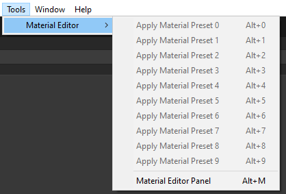
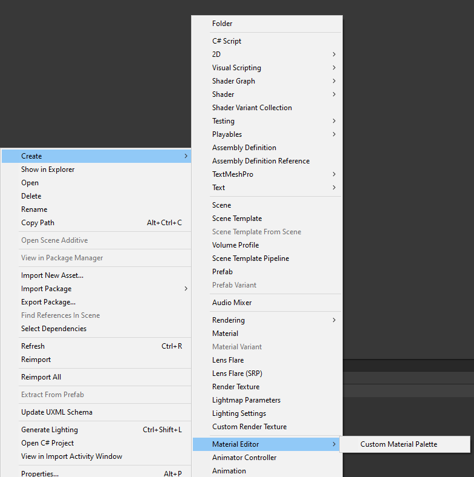
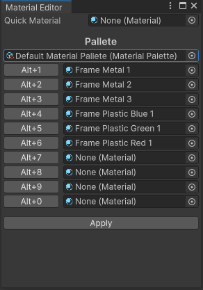

# Material Palette

## Setup
- Open the panel use `Tools/Material Editor/Material Editor Panel` or use Shortcut `Alt+M`

- Create Material Palette use Context Menu `Create/Material Editor/Custom Material Palette`

- Apply Material Palette in Material Editor Panel

## Usage
- Use the buttons in the material slots or the keyboard shortcuts to apply material to objects
  
- Use the Apply button to apply Quick Material to objects

## Notice
- If you want to use shortcuts, the material editor panel must be open
- The material is applied to all renderer components in the selected and parent GameObjects.